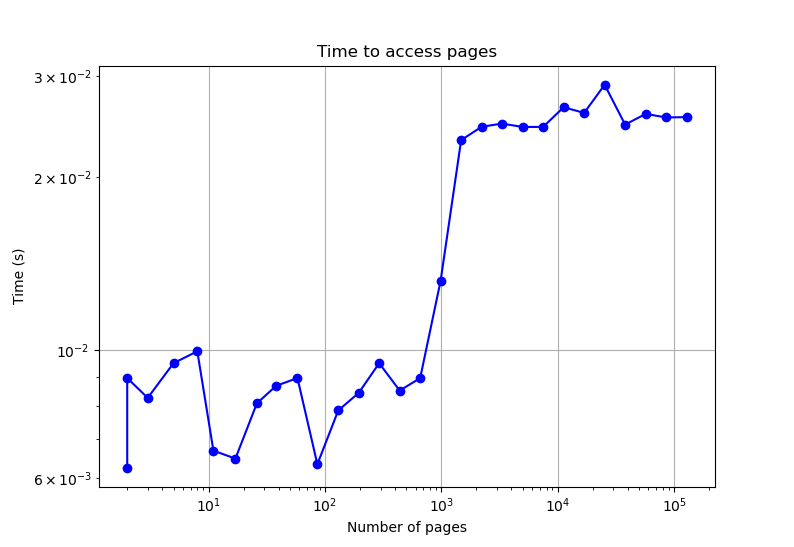

# Homework: Measuring TLB size
Name: Christian Magnus Engebretsen Heimvik
Kingo ID: 2025318314

## Question 1
As we are measuring more than the actual duration of the time interval, that is the executions of the instructions to read the HW timer itself and other overhead. Online sources states that it is accurate for, and has a precision of around 1 us. That is, for the timing to be accurate, we should at least have some 10s us of timing interval, or a large number of trials to compensate for the inaccuracy in the measurement (central limit theorem).

## Question 2
To do the tests within reasonable time, I wrote the following test program in C, based its timing off the gettimeofday(), and running 10k trials each time.

```c
#include <stdio.h>
#include <unistd.h>
#include <sys/time.h>
#include <stdlib.h>

#define NITERATIONS 1e4

long long getTimeUs() {
    struct timeval tv;
    gettimeofday(&tv, NULL);
    return (tv.tv_sec * 1000000) + tv.tv_usec;
}

double getAvgPageAccessTime(int numPages){
    //The TLB a given anount of entries for a given anount of pages. As number of pages we access increase, more TLB misses
    size_t pageSize = getpagesize();

    //The number of ints in one page
    size_t jump = pageSize/sizeof(int); 
    
    //volatile to avoid optimaizations
    volatile int* a = (int*)calloc(jump*numPages,sizeof(int)); 
    
    //Time taking defs
    long long start,end;
    double elapsedAvg = 0;

    start = getTimeUs();
    for(int i = 0; i<NITERATIONS;i++){
        for(int i = 0;i<jump*numPages;i+=jump){
            a[i] += 1;
        }
    }
    free((void*)a);
    end = getTimeUs();
    return (double)(end - start) / (numPages * NITERATIONS);
}

int main(int argc, char* argv[])
{
    if (argc != 2) {
        fprintf(stderr, "Usage: %s <numPages>\n", argv[0]);
        return 1;
    }
    int numPages = atoi(argv[1]);
    double avgTime = getAvgPageAccessTime(numPages);
    printf("%f\n", avgTime); //Printf to stdout, let python program pick it up
    return 0;
}
```

## Question 3
I then wrote a python script to run the program that increments the number of pages in a exponential manner, for then to plot the results in a graph.

```python
import matplotlib.pyplot as plt
import subprocess

PAGES_MAX = int(1e5)

pageTesterProgram = "./hw19"  # Path to the compiled C program
cpu_affinity_command = ["taskset", "-c", "0", pageTesterProgram] #Lock it onto cpu 0 (affinity)
x_pages = []
y_time = []

base = 1.5
exp = 0
while True:
    exp += 1
    pages = int(round(base**exp,0))
    command = cpu_affinity_command + [str(pages)]
    result = subprocess.run(command, capture_output=True, text=True, check=True)
    x_pages.append(pages)
    y_time.append(float(result.stdout.strip()))
    print("Done with", pages, "pages\n")
    if(PAGES_MAX < pages):
        break

print("Plotting data:", x_pages, y_time)
plt.plot(x_pages, y_time, marker='o', linestyle='-', color='b')
plt.xlabel("Number of pages")
plt.ylabel("Average access time per page(us)")
plt.semilogx()
plt.grid(True)
plt.title("Time to access pages")
plt.show()
```

# Question 4
The plot obtained from the python script is in fact very intresting. The plot is shown below.


Here we can see that my laptop probably has a 1-level TLB. This comes from the fact that it only has one step where it will be exausted afterwards. We can also see that it is capable of holding the translations of about 500-600 pages, before it starts to miss violently (mass eviction). Note that the y-axis is in log scale, making the plot more readable.

# Question 5
Compiled with the following command to avoid compiler optimizations
```bash
gcc -O0 -o hw19 hw19.c
```

# Question 6
Run with the taskset command to lock it onto cpu 0, to avoid context switches and other overheads. This is done with the following command.
```bash
taskset -c 0 ./hw19 100000
```

# Question 7
The problem of initialization issues is dealt with by using the calloc() instad of malloc(), as calloc() initializes the memory to zero. Thus, if calloc initializes every entry in a way that reflects our access pattern, the TLB's performance will be more accurately reflected in the measurements. This is done in the following line:
```c
volatile int* a = (int*)calloc(jump*numPages,sizeof(int)); 
```
I've also made it volatile, to further negate any compiler optimizations that might affect the results.