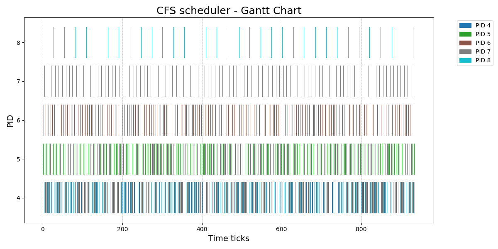
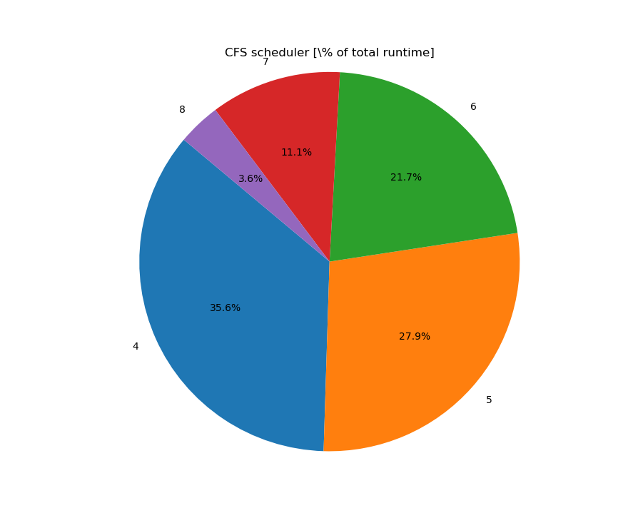

# CFS Scheduler
Name: Christian Magnus Engebretsen Heimvik
Kingo ID: 2025318314

## Pre-implementation: How the scheduling worked
The scheduling on the XV6 before my implementation operated with 3 *levels* of context. First of all; all the way down is the user process, with the corresponding "lowest" context. Say process A is running user program with its corresponding context and a timer tick happens. What happens then is that the timer interrupt is catched by the IDT (as explained in the previous report), corresponding vector in `vectors.S` is executed, which does `jmp alltraps` which jumps to `trapasm.S` where the building of the trapframe happens and the instruction to `call trap` is executed. 

This changes the context from the lower user-level context to process A's kernel-context, and we are now in the kernel in `trap.c`. This can be regarded as a "middle" context, and under syscalls only these two contexts are used back and fourth. However, under a timer interrupt tick the following code statement in `trap.c` will be evalueated true
```C
if(myproc() && myproc()->state == RUNNING &&
    tf->trapno == T_IRQ0+IRQ_TIMER)
yield();
```
which invokes the call to `yield()`. This call to `yield()` will first lock the process table, change the process's A own state, for then to call `sched()` which call `swtch()`. The `swtch()` call changes the context once more (by switching cpu registers, changing instruction and stack pointer) from the "middle" context of process A to the "highest" context of the scheduler.

With this new highest context, the execution will appear out of `swtch()` in `scheduler()` as if nothing happend. After switching the per-process page table and releasing the page table lock (for other cpus to grab it), the next process in the process list is chosen. Say process B time. The function `scheduler()` then calls `swtch()` which switches context down to "middle" level, but this time execution and context will come out of process B's kernel `swtch()`. Execution will then return back to the "lowest" user context of process B, trough the interrupt return. User program B will then continue executing.

From this it's evident that the scheduling itself is found in the `scheduler()`'s context, and by calling the `swtch()` with the right `struct context` for the old and new context, we can direct the execution whereever we want.
## How the CFS scheduler works
The Completely Fair scheduler (CFS) is a CPU scheduling algorithm that aims to provide fair CPU time to all processes in the system, while also taking priorities into account. Each process has 3 major variables that determine its behaviour in the scheduler:
- **weight**: The weight of a process is calculated as the inverse of its niceness. The nicess, the lower the weight. The weight is hard coded due to its constant nature and given as an array, indexed by its corresponding niceness. The array of weights was generated by a simple python script and is defined in the top of `proc.c` as `static const`.

- **vruntime**: A variable that accumulates when the process is running, and it tracks the "effective" amount of time a process has been running, accordng to its priority. The vruntime for a given process needs to be updated after every time it has run, and the increment in vruntime of a given process p after each run is
\\[ \text{p->vruntime} += \text{p->vruntime}\frac{\text{weights}[20]}{\text{p->weight}}\\]
- **timeslice**: The timeslice a process is allowed to run before has to yield. It must in all cases be larger than sched_granularity. The timeslice has to be calculated the when having picked the next one based of the vruntime of the processes, and before the process is set to RUNNING state by the following formula, where 10 is out sched_latency or our ticks:
$$ \text{p->timeslice} = \text{SCHED\_LATENCY} + \frac{\text{weight[p->pid]}}{\sum_i \text{p[i]->state == RUNNABLE ? weight[p[i]->pid] : 0}}$$

The CFS scheduler will then schedule the processes as follows:
1. Pick the process with the lowest vruntime from RUNNABLE processes.
2. Calculate the timeslice for the process according to the equation above.
3. Set the process to RUNNING state and switch contexts.
4. When done running, update the vruntime of the process according to the equation above.
5. If not done, set the process state to RUNNABLE. On exit the process will set remove it self from the ready queue.
6. Go to step 1.

## Implementation
For the sake of our implementation, we must consider the following:
- Each process that is running, will be interrupted each timer tick (each time the timer interrupt is called) and execution will end up in `cfsscheduler()` with its context. Implement the scheduler algorithm here.
- Update ps correctly.

Also, as the CFS scheduler relies on and modifies global state, this is something we need to maintain correctly through all process state changes. The `timeslice` will be maintained in the `cfsscheduler()`, but the `vruntime` and `runtime` must be maintained different places to cover all cases.  How and where we are modifying the global state changes to enusre correct operation in all cases, is shown below.
- When process `init()`'d: This is the first process that is created and the scheduler will be initialized. Make sure it receives the default niceness of 20 and initialize the other values to 0.
- When process `fork()`'d: This is the default initialization of a new process. Child process `np` inherits niceness, runtime, vruntime and timeslice of parent `curproc`. This is done in `fork()` in `proc.c` as follows:
```C
np->schedstate.nice = curproc->schedstate.nice;
np->schedstate.runtime = curproc->schedstate.runtime;
np->schedstate.vruntime = curproc->schedstate.vruntime;
np->schedstate.timeslice = curproc->schedstate.timeslice;
```
- When process `yield()`: This happens every time tick and called from trap.c. Here `runtime` needs to be incremented (by 1000 milliticks) to keep track of each process actual runtime before it yields. We should also update `vruntime` to reflect the _effective_ runtime the current process has had within the 1000 millitics. This is done in `yield()` in `proc.c` as follows:
```C
p->schedstate.runtime += MTICKS;
p->schedstate.vruntime += calcvruntime(MTICKS,p->schedstate.nice);
```
- When process `wakeup1()`'d: Here, multiple things will happen. First of all we have to wakeup the correct process, but also search through _all_ processes and find the minimum `vruntime` of all, and set the `vruntime` of the process we are waking up to the `minvruntime` minus the minvruntime worth 1 tick of the process we are waking up. Its also here we include the logic for updating the `vruntime` to be 0 whenever there are no other RUNNABLE processes. This addresses parent process wakeup from `sleep()`, but also wakeup from from `wait()`. This is done in `wakeup1()` in `proc.c` as follows:
```C
struct proc *p;
int sleepingprocfound = 0;
int runnableprocfound = 0;
int minvruntime = 0x7FFFFFFF;
for(struct proc* iterp = ptable.proc; iterp < &ptable.proc[NPROC]; iterp++){
    if(iterp->state == SLEEPING && iterp->chan == chan){
        sleepingprocfound = 1;
        p = iterp; //This is the process we want to wake up
    }
    if(iterp->state == RUNNABLE){
        runnableprocfound = 1;
        if(iterp->schedstate.vruntime < minvruntime && iterp->schedstate.vruntime > 0){
            minvruntime = iterp->schedstate.vruntime;
        }
    }
}
if(sleepingprocfound){
    p->state = RUNNABLE;
    if(runnableprocfound){
        p->schedstate.vruntime = minvruntime-calcvruntime(MTICKS,p->schedstate.nice);
    } else {
        p->schedstate.vruntime = 0;
    }
}
```
- When process `kill()`'d: There is no way back from this state, no reviving possible. Thus, no update of global state is needed as it exits in any case.
- When process `exit()`'d: Nothing, it will never be run again.

The `sched()` to the newly woken process is not included in the `wakeup1()`, but this is the default implementation. This makes sense as well, **the wakeup does and should not overrule the make the** `cfsscheduler()`. It shouldn't force anything to happen, but rather make it avalibale for the scheduler, which we do by changing it's state. If we want the woken up process to be run more recently after wakeup, give it higher priority then. 

At last we need to implement the `cfsscheduler()` itself. This is done by following the (almost) exact same steps as given above in the enumerated list. We start by locking the process table, find the process with the lowest vruntime out of the runnable processes, and this is the process we need to run. Note that we are also simountaneously calculating the `weightsum` of the RUNNALBLE processes, as this needs to be used in the denominator of timeslice calculation, for the process we have just found with the lowest vruntime.

If no runnable processes are found, we do a `continue` to continue to the next iteration of the infinite loop. We are busy-waiting for a process to be woken up. The `cfsscheduler()` then assigns the chosen process to the cpu, switches to the page table to the chosen process, and then calls `swtch(&(c->scheduler), p->context);	` wich switchs contexts into the chosen process kernel context. The complete code is included in function `cfsscheduler()` in `proc.c`.

## Verification
Now, verifying the implementation of the CFS scheduler is a bit tricky. However, there are some characteristics of the CFS scheduler were used to verify the correct functionality of the implementation. The following characteristics and printouts of the behaviour of the scheduler is sho**uwn below.
1. **The one with the lowest vruntime should always be the one running.**
To verify this, the ps() systemcall were used, in c**ombination with forking out multiple children with different niceness. All tests showed similar results as the one below, where PID 4,5,6 all has similar PIDs, but the one wil the lowest `vruntime` wins. Totalticks value here is excluded for compactness.
```bash
NAME       PID  STATE     NICE  RT/WGT   RUNTIME  VRUNTIME
init       1    SLEEPING  20    0        1000     0
sh         2    SLEEPING  20    2        3000     0
udevtests  3    SLEEPING  20    4        5000     1000
udevtests  4    RUNNABLE  0     9        871000   9537
udevtests  5    RUNNABLE  1     9        685000   9534
udevtests  6    RUNNING   2     8        479000   9532
udevtests  7    RUNNABLE  20    13       14000    10000
udevtests  8    RUNNABLE  39    400      6000     69266
```
2. **The order in which they finish should always be in order of how nice each process is. The lower the niceness, the earlier the finish of the process.**
To verify this, the same 5 children were forked out, assigned a workload and were asked to print whenever they started and finished. As shown below, the least nicess process (PID 4) got to start first and also finishes first. The other processes also finished in the order of their niceness, with the most nice process (PID 8) finishing last. The printout is shown below.
```bash
PID 4 | nice 0 started.
PID 5 | nice 1 started.
PID 6 | nice 2 started.
PID 7 | nice 20 started.
PID 4 | nice 0 finished
PID 5 | nice 1 finished
PID 6 | nice 2 finished
PID 8 | nice 39 started.
PID 7 | nice 20 finished
PID 8 | nice 39 finished
```

3. **Processes with lower niceness will get a lower virtual runtime, thus an increment in vruntime will be smaller than for processes with higher niceness. This means that processes with an almost equal amount of little niceness is expected to have more or less the same vruntime at any given time.**
The printout in point 1. verifies this. Processes 4,5,6 all has similar pids and their corresponding vruntime increment each tick is in the scale of 10's. Thus we expect these to be almost equal, which they are. However, we cannot expect the same for i.e. process 7 and 8, as they have a much larger difference in each `vruntime` increment, respectively 1000 and 68266 each increment. This is also verified in the printout, where process 7 has a vruntime of 10000 and process 8 has a vruntime of 69266. Thus we can see that the nicer pid 7 process has run 10 times with niceness 20 and pid 8 process has run one time with niceness 20 before the niceness was changed to 39, where it also has run for one tick.
4. **When when each process is printing their PID, we should see the execution distribute between the processes according to their niceness. The lower the niceness, the more often should it print.**
To verify this, a helper function was made to make each process print its own PID each time they had execution. Then the pyton program in appendix was made to plot the execution as a Gantt and pie chart. The results are shown below when the test function in udevtests.c forks out child processes with pids 4,5,6,7,8 with pids respectively 0,1,2, 5 and 10. All printouts in the results were used when all processes executed. From this, 4 is the **least** nice process and we expect it to have the most runtime. Process 8 is the most nice process and we expect it to have the **most** runtime. The results are shown below, and follow our expectations to the point. The scheduler is working as it should.

